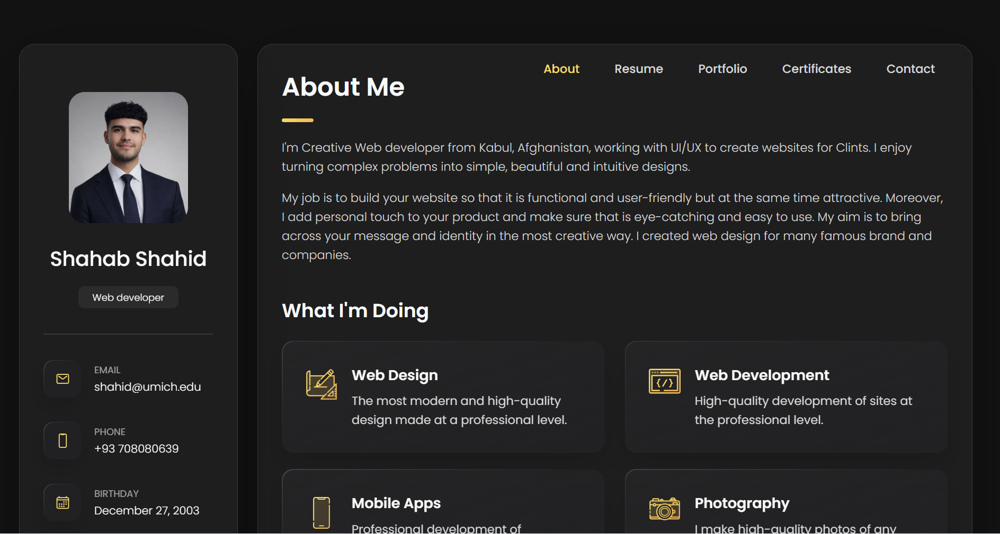

# Shahab Shahid – Personal Portfolio Website

This portfolio is a lightweight web application built using **HTML, CSS, and JavaScript**, showcasing projects, research, and technical skills in **full-stack development, artificial intelligence, and cybersecurity**.

It serves as a central platform to present academic work, practical projects, and professional interests in a clear and structured format.

---

## 📸 Preview

[➥ Live Demo](https://shahidportfoli3.netlify.app)

---

## 🛠️ Technologies

- HTML5  
- CSS3  
- JavaScript  

---

## 📱 Features

- Responsive and modern design  
- Clean and minimal interface  
- Project and research showcase  

---

## 📂 Structure

/project-root  
├── index.html  
└── assets/  

---

## 📄 License

MIT License
